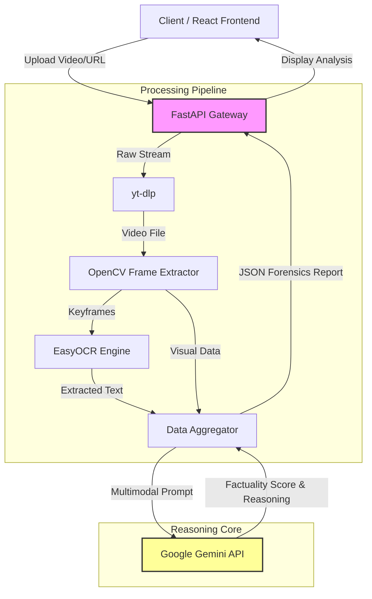

# Vigil AI: Multimodal Misinformation Detection Engine

> **Automated video forensics pipeline powered by Computer Vision and Google Gemini.**

   

## 🔍 Overview
**Vigil AI** is a real-time multimodal forensic tool designed to combat digital misinformation. Unlike simple text-checkers, Vigil AI ingests raw video streams, deconstructs them into frame-by-frame metadata using Computer Vision (OpenCV), extracts on-screen text via OCR, and utilizes **Google Gemini** to reason about the visual and semantic context.

The system is built on a high-concurrency **FastAPI** backend, capable of processing video content to detect synthetic manipulation, context mismatch, and factual inconsistencies.

## 📐 System Architecture



## 🚀 Key Features

* **Multimodal Ingestion:** Handles raw video files and YouTube streams via `yt-dlp`.
* **Frame-Level Forensics:** Uses `OpenCV` to sample and analyze keyframes for visual anomalies.
* **Intelligent OCR:** Extracts embedded text from video frames for cross-referencing.
* **Gemini Reasoning Engine:** contextualizes visual data against known facts to score credibility.
* **Evidence-Based Reporting:** Delivers a comprehensive analysis report, not just a pass/fail score.

## 🛠️ Tech Stack

* **Core Engine:** Python 3.10+, Google Gemini API
* **Computer Vision:** OpenCV, EasyOCR
* **Backend:** FastAPI (Async Architecture), Uvicorn
* **Frontend:** React.js, Tailwind CSS
* **Utilities:** yt-dlp, FFmpeg

## 📂 System Architecture Docs

We believe in rigorous documentation. Explore the internal architecture of Vigil AI:

* **[System Overview](https://www.google.com/search?q=./SYSTEM_OVERVIEW.md)** - High-level architectural design.
* **[OCR Implementation](https://www.google.com/search?q=./OCR_IMPLEMENTATION.md)** - Deep dive into our text extraction pipeline.
* **[Search Optimization](https://www.google.com/search?q=./GEMINI_SEARCH_OPTIMIZATION.md)** - How we tune Gemini for forensic accuracy.
* **[API Documentation](https://www.google.com/search?q=./API.md)** - Endpoints and integration guide.

## ⚡ Quick Start

### Prerequisites

* Python 3.10+
* Node.js & npm
* Google Gemini API Key

### Backend Setup

```bash
# Clone the repository
git clone [https://github.com/sairishigangarapu/vigilant-octo-enigma.git](https://github.com/sairishigangarapu/vigilant-octo-enigma.git)
cd vigilant-octo-enigma/backend

# Install dependencies
pip install -r requirements.txt

# Configure Environment
# Create a .env file and add: GOOGLE_API_KEY=your_key_here

# Run the Engine
uvicorn main:app --reload

```

### Frontend Setup

```bash
cd ../frontend

# Install dependencies
npm install

# Launch Interface
npm start

```

## 👥 Contributors

* **Harsh Pandya**
* **Harsh Patnaik**
* **Ponakala Yatish**
* **Adyanth Mallur**
* **Sai Rishi Gangarapu**

## 📄 License

This project is licensed under the MIT License - see the [LICENSE](https://www.google.com/search?q=LICENSE) file for details.


You have 22 prompts left.

```
